# Install-Hadoop-Spark-Kafka-cluster-on-VMs
## Trong bài viết này mình cài cụm Hadoop, Spark, Kafka trên 2 máy ảo.
## 1. Cấu hình máy ảo
Mình cài đặt các máy ảo trên VirtualBox. Các bước thức hiên như sau:
- Tạo 1 máy ảo mới và đặt tên là ***vm1*** như hình:

    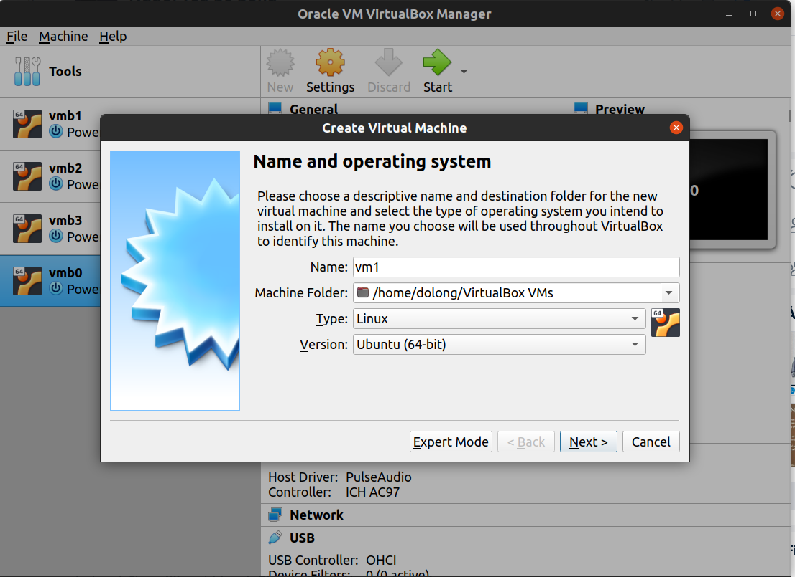

- Ram máy ảo tùy theo cấu hình máy của từng người, mình để 2GB:

    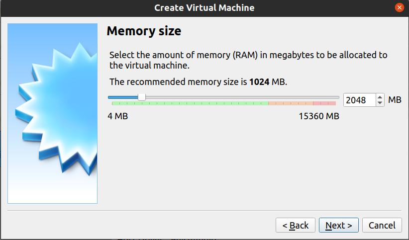

- Tiếp tục đến phần Storage. Mình để bộ nhớ máy ảo là 20GB.
- Những phần khác để mặc định.
- Cuối cùng có cấu hình máy như sau:

    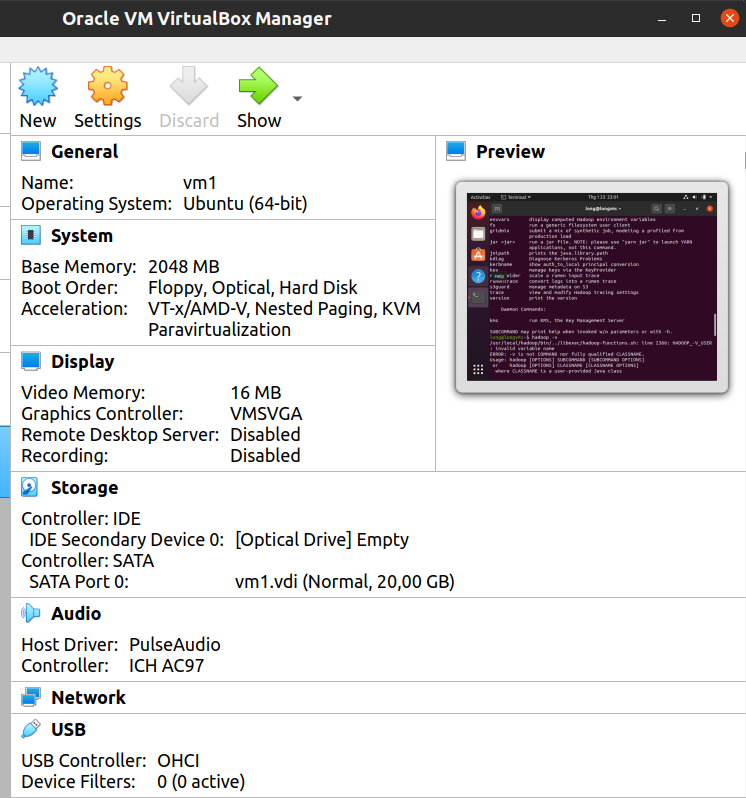
- Khởi động máy ảo, kiểm tra thông tin về  mạng:
    ```
    ip addr
    ```
    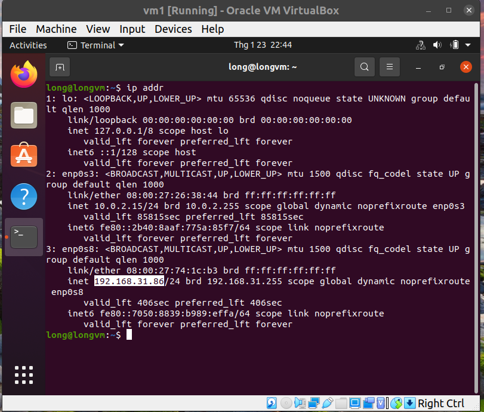

- Cài đặt SSH:
    - SSH, hoặc được gọi là Secure Shell, là một giao thức điều khiển từ xa cho phép người dùng kiểm soát và chỉnh sửa server từ xa qua Internet. Nó cung cấp thuật toán để chứng thực người dùng từ xa, chuyển input từ client tới host, và lấy kết quả trả về tới khách hàng.
    - Tham khảo thông tin về SSH: 
    
        https://www.hostinger.vn/huong-dan/ssh-la-gi-va-cach-su-dung-ssh-cho-nguoi-moi-bat-dau
    - Trong bài viết này mình sử dụng SSH để kết nối các máy ảo với nhau.
        ```
        sudo apt update
        sudo apt install ssh
        ```
    - Bấm y:
    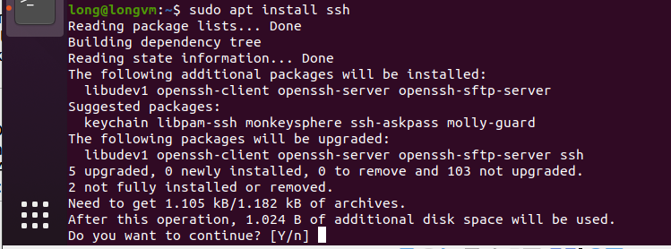
    - Tạo khóa SSH:
        ```
        ssh-keygen -t rsa -P ""
        ```
    - Tiếp tục bấm "Enter" khi được yêu cầu ( Vì mình làm lại lần 2 nên hơi khác một chút nhưng không ảnh hưởng gì. )

        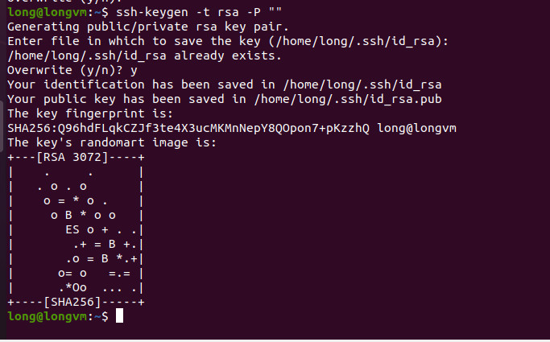
    - Sau khi có được khóa ssh thì copy vào 1 file tên là authorized_keys
        ```
        cat ~/.ssh/id_rsa.pub >> ~/.ssh/authorized_keys
        ```
        
    - Kết nối thử với localhost để kiểm tra cài đặt thành công chưa:
        ```
        ssh localhost
        ```
    - Bấm "yes" khi được yêu cầu

        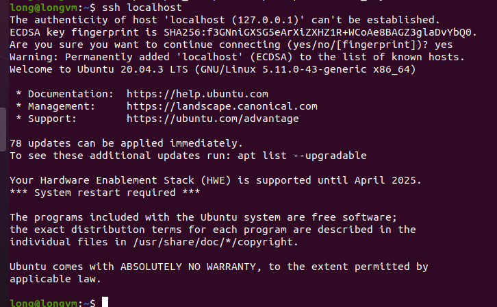

- Tiếp theo là cài đặt PDSH. 
    - Về cơ bản PDSH giúp các máy ảo có thể thực thi cùng 1 câu lệnh mà không cần log in vào từng máy để thực thi câu lệnh đó.
        ```
        sudo apt install pdsh
        ```
    - Mở file .bashrc
        ```
        nano .bashrc
        ```
    - Thêm dòng lệnh sau:
        ```
        export PDSH_RCMD_TYPE=ssh
        ```
         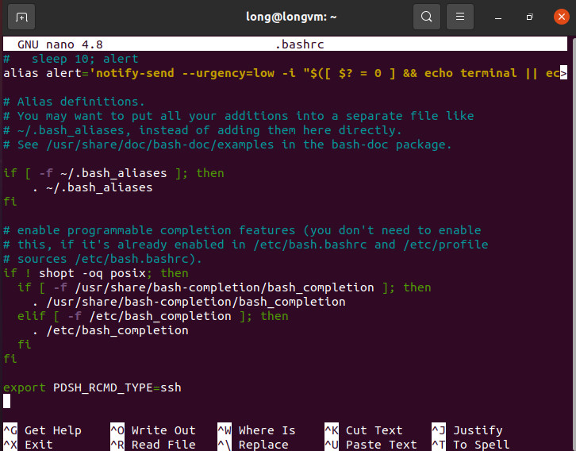

- Cài đặt Java:
    ```
    sudo apt install openjdk-11-jdk
    ```
- Kiểm tra Java version đang có:
    ```
    java -version
    ```
    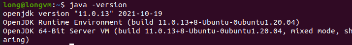
- Mình đang chỉ thao tác trên 1 máy. Để tránh mất thời gian thì trong phần sau mình sẽ tạo ra máy thứ 2 băng cách clone máy thứ 1.

## 2. Cài đặt cụm Hadoop
- 
- Tải file từ trang chủ Hadoop:
    [https://dlcdn.apache.org/hadoop/common/hadoop-3.2.2/hadoop-3.2.2-src.tar.gz](https://dlcdn.apache.org/hadoop/common/hadoop-3.2.2/hadoop-3.2.2-src.tar.gz)
- Hoặc cũng có thể dùng câu lệnh để tải như sau:
    ```
    sudo wget https://dlcdn.apache.org/hadoop/common/hadoop-3.2.2/hadoop-3.2.2-src.tar.gz
    ```
- Giải nén file:
    ```
    tar xzf hadoop-3.2.2.tar.gz
    ```
- Rút gọn tên file:
    ```
    mv hadoop-3.2.2 hadoop
    ```
- Mở file **hadoop-env.sh** để thay đổi biến **JAVA_HOME**:
    ```
    nano ~/hadoop/etc/hadoop/hadoop-env.sh
    ```
- Kéo đến cuối file và thêm dòng dưới đây vào file:
    ```
    export JAVA_HOME=/usr/lib/jvm/java-11-openjdk-amd64/
    ```
    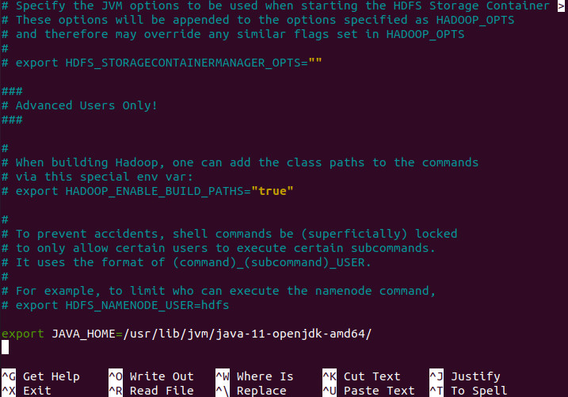

- Chuyển folder **hadoop** đến **/usr/local/hadoop**
    ```
    sudo mv hadoop /usr/local/hadoop
    ```
- Mở file **environment**:
    ``` 
    sudo nano /etc/environment
    ```
- Thêm dòng sau vào trong file:
    ```
    JAVA_HOME="/usr/lib/jvm/java-11-openjdk-amd64/jre"
    ```

    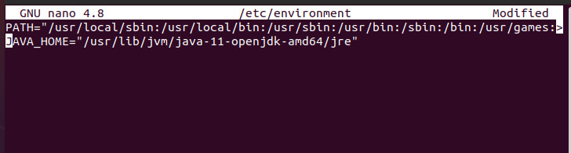

- Thêm **user** để thao tác với user này về sau:
    ```
    sudo adduser hadoopuser
    ```
    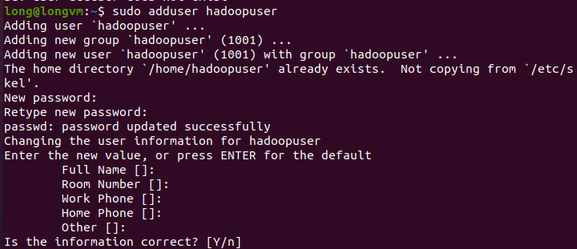
- Cấp quyền cho user này:
    ```
    sudo usermod -aG hadoopuser hadoopuser
    sudo chown hadoopuser:root -R /usr/local/hadoop/
    sudo chmod g+rwx -R /usr/local/hadoop/
    sudo adduser hadoopuser sudo 
    ```
    

- Đổi tên hostname thành hadoop-master:
    ```
    sudo nano /etc/hostname
    ```
    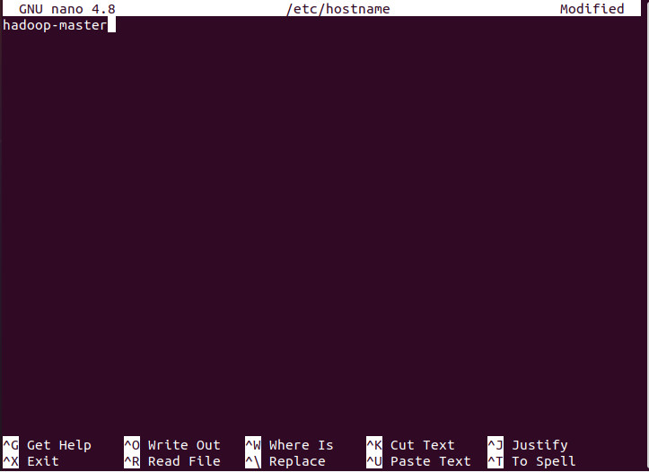
- Mở file **/etc/hosts** để thêm các cài đặt mạng. Như hình ở trên thì máy ảo này có địa chỉ IP là **192.168.31.86**. Phần tiếp theo sẽ tạo thêm 1 máy ảo nữa bằng cách clone máy ảo hiện tại. Máy ảo mới có địa chỉ IP là **192.168.31.87**
    ```
    sudo nano /etc/hosts
    ```
    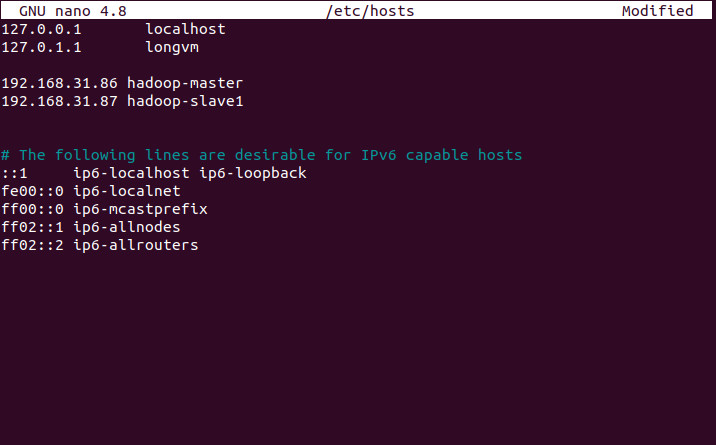

- Tắt máy ảo hiện tại và clone máy ảo mới tên là vm1_clone. Chọn **Generate ...** và **Full clone**
    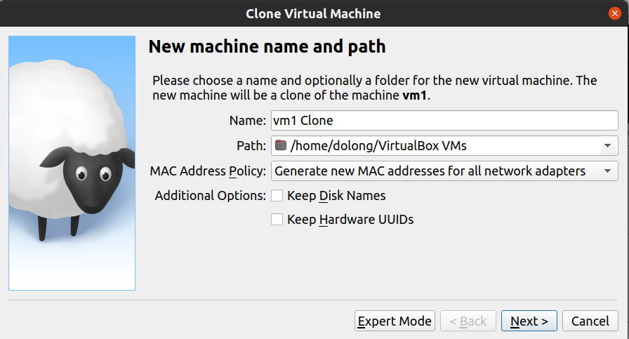
- Khởi động 2 máy ảo lên. Máy ban đầu gọi là master, máy 2 là slave. Thay đổi tên cho máy thứ 2.
    ```
    sudo nano /etc/hostname
    ```
    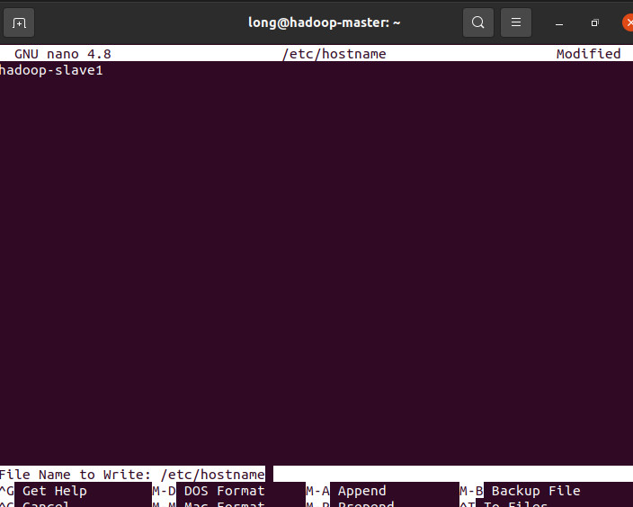
    Khởi động lại máy ảo thứ 2.
- Swith user sang hadoopuser trên cả 2 máy.
- Tạo SSH key (thao tác trên máy master):
    ```
    ssh-keygen -t rsa
    ```
    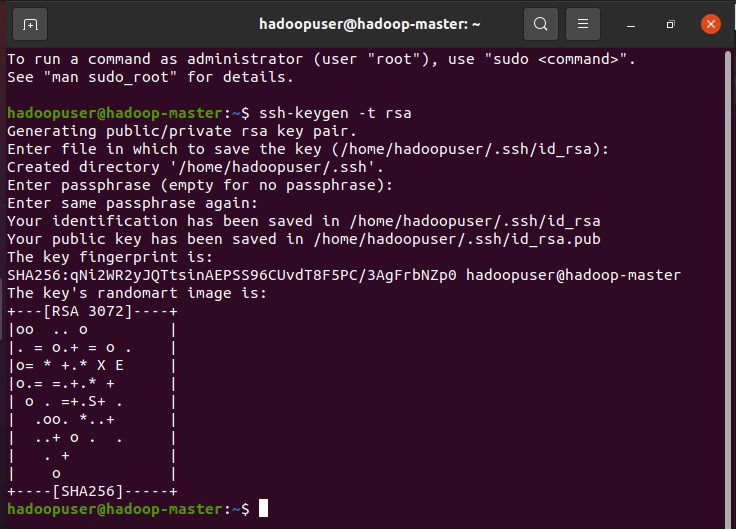
- Copy SSH key trên các user của 2 máy ảo:
    ```
    ssh-copy-id hadoopuser@hadoop-master
    ```
    ```
    ssh-copy-id hadoopuser@hadoop-slave1
    ```
- Chỉnh sửa trên các file **core-site.xml**, **hdfs-site.xml**, **workers** 
    ```
    sudo nano /usr/local/hadoop/etc/hadoop/core-site.xml
    ```
    Truy cập trên **hadoop-master** bằng cổng 9000. 
    Thêm các cài đặt sau:
    ```
    <configuration>
    <property>
    <name>fs.defaultFS</name>
    <value>hdfs://hadoop-master:9000</value>
    </property>
    </configuration>
    ```
    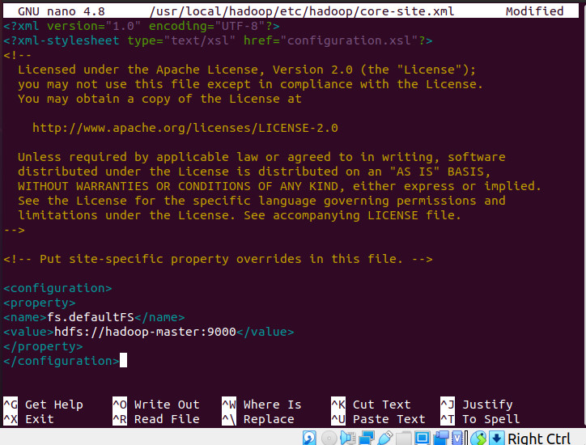

- Mở file **hdfs-site.xml** và tiến hành các bước sau:
    ```
    sudo nano /usr/local/hadoop/etc/hadoop/hdfs-site.xml
    ```
    Cài đặt số replication là 2 thay vì mặc định là 3.
    ```
    <configuration>
    <property>
    <name>dfs.namenode.name.dir</name><value>/usr/local/hadoop/data/nameNode</value>
    </property>
    <property>
    <name>dfs.datanode.data.dir</name><value>/usr/local/hadoop/data/dataNode</value>
    </property>
    <property>
    <name>dfs.replication</name>
    <value>2</value>
    </property>
    <property>
    <name>dfs.permissions</name>
    <value>false</value>
    </property>
    </configuration>
    ```
    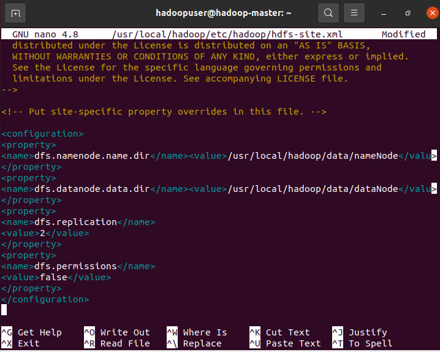
- Tiếp tục mở file **workers**:
    ```
    sudo nano /usr/local/hadoop/etc/hadoop/workers
    ```
    Sửa **localhost** thành **hadoop-slave1**
    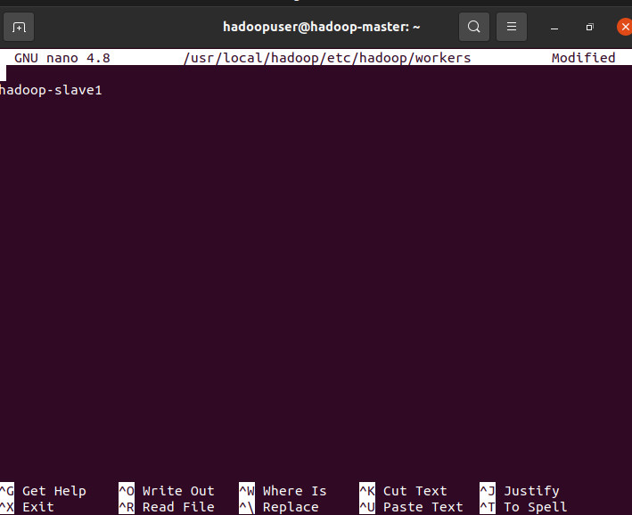
- Mở file .bashrc
    ```
    sudo nano .bashrc
    ```
    Thêm 2 dòng sau vào cuối file:
    ```
    PATH=$PATH:/usr/local/hadoop/sbin
    export PDSH_RCMD_TYPE=ssh
    ```
    Sau đó chạy câu lệnh sau:
    ```
    source .bashrc
    ```
- Copy các cài đặt từ máy master sang máy slave:
    ```
    scp /usr/local/hadoop/etc/hadoop/* hadoop-slave1:/usr/local/hadoop/etc/hadoop/
    ```
    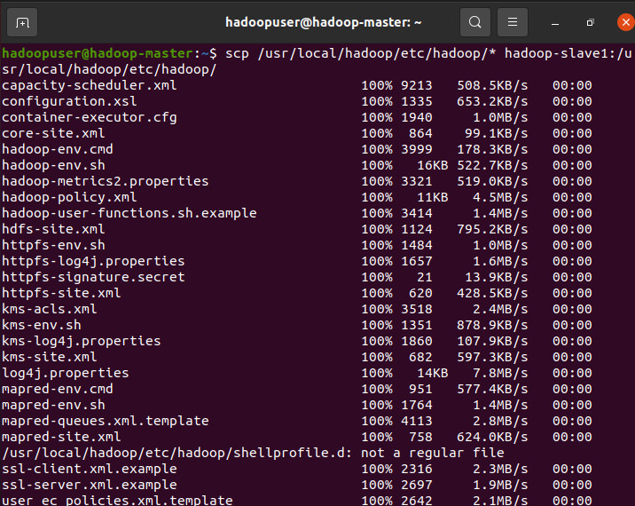

- Format HDFS file system:
    ```
    hdfs namenode -format
    ```
- Khởi chạy cụm hdfs:
    ```
    start-dfs.sh
    ```
    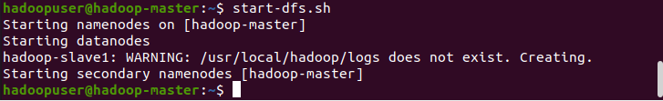

- Truy cập địa chỉ [localhost:9870](localhost:9870) để xem thông tin cụm hadoop:
    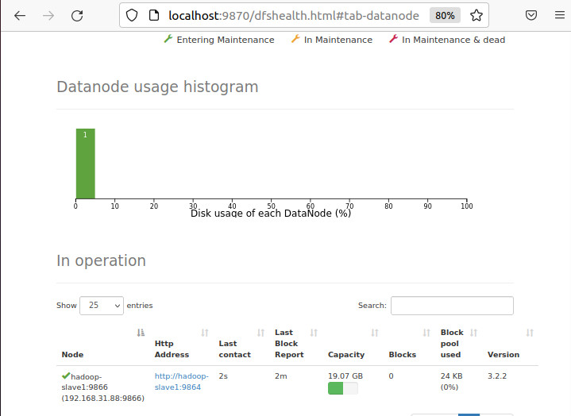
- Upload 1 file:
    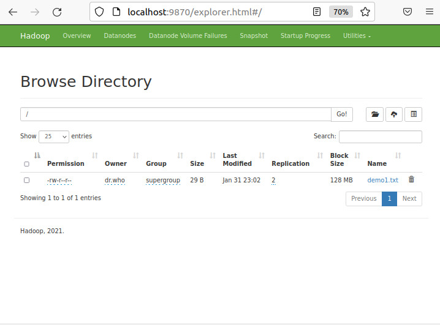
    
## 3. Cài đặt Spark
- Truy cập địa chỉ: https://spark.apache.org/downloads.html để cài đặt phiên bản phù hợp. Chọn bản 3.1.2 để phù hợp với phiên bản hadoop 3.2.2 đã cài đặt trước đây. 
- Tải file theo đường dẫn của trang web về máy. Sau đó tiến hành giải nén file.
    ```
    cd ./Downloads
    tar -xzf spark-3.1.2-bin-hadoop3.2.tgz
    ```
- Rút gọn tên file
    ```
    mv spark-3.1.2-bin-hadoop3.2 spark
    ```
- Chuyển vào trong thư mục mới
    ```
    sudo mv spark /usr/local/spark
    ```
- Mở file **.bashrc** thêm 2 dòng sau:
    ```
    SPARK_HOME=/usr/local/spark
    PATH=$PATH:$SPARK_HOME/bin
    JAVA_HOME=/usr/lib/jvm/java-8-openjdk-amd64
    ```
- Chạy câu lệnh sau để các biến có hiệu lực:
    ```
    source .bashrc
    ```
- Chạy thử spark-shell:
    ```
    spark-shell
    ```
    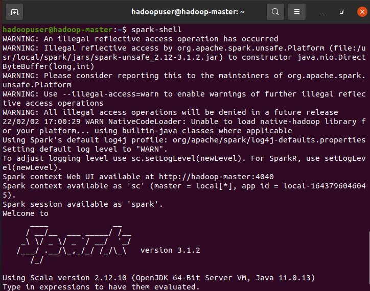
